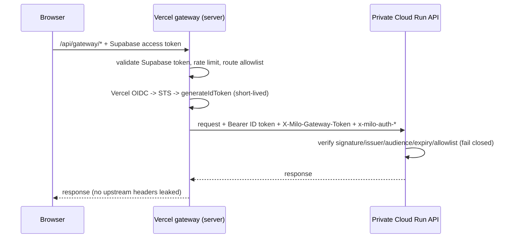
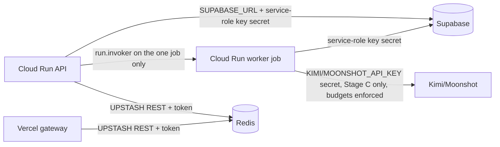
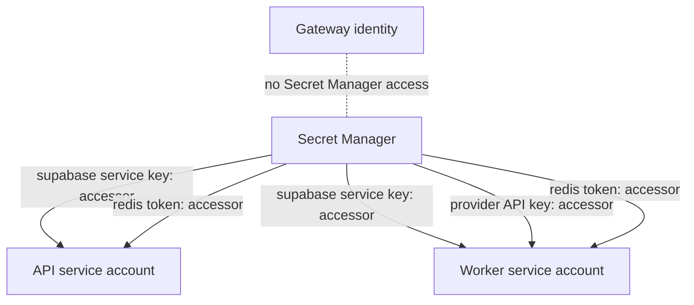
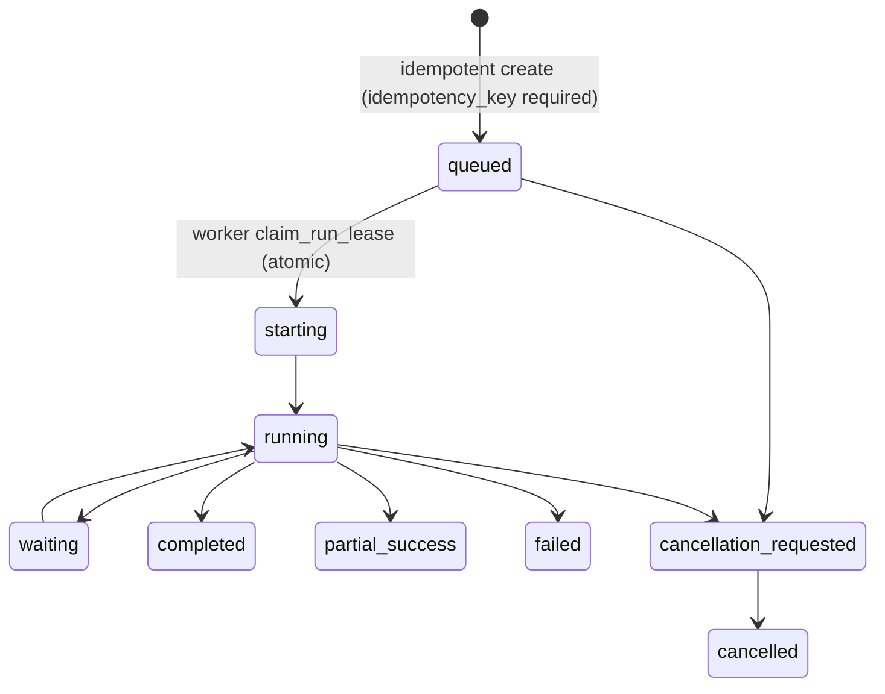
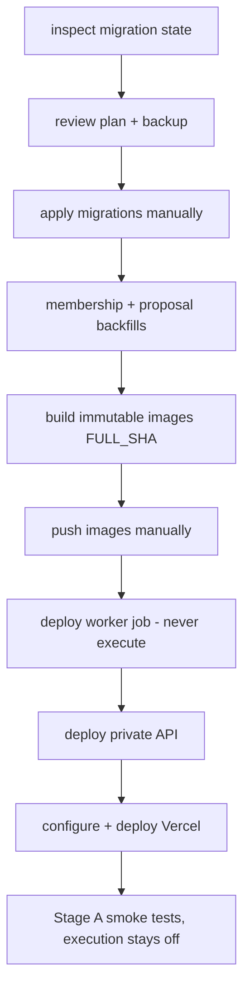
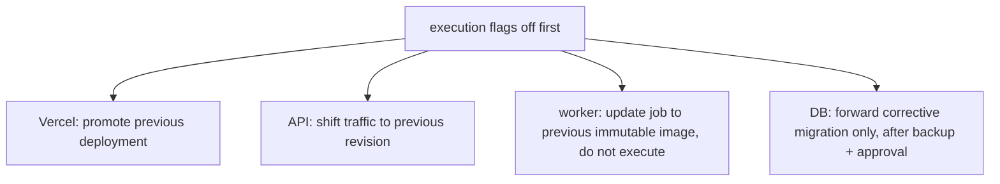

# Final architecture

Status: `COMPLETED_IN_CODE` (application architecture) /
`REQUIRES_MANUAL_OPERATOR_CONFIGURATION` (external resources).

## Components

- **Frontend (Next.js on Vercel)** — browser UI plus a server-side gateway
  route (`frontend/app/api/gateway/[...path]/route.ts`). The browser never
  talks to the private API directly and never holds any credential beyond
  its own Supabase session.
- **Vercel gateway (server runtime)** — validates the user's Supabase
  access token, applies IP/user rate limits, enforces the route allowlist
  (`frontend/lib/server/gatewayPolicy.ts`), then mints a short-lived
  Google ID token via Vercel OIDC → Workload Identity Federation
  (`frontend/lib/server/cloudRunAuth.ts`) and forwards the request with
  `X-Milo-Gateway-Token` plus vetted `x-milo-auth-*` identity headers.
- **Private Cloud Run API (FastAPI, `Dockerfile.api`)** — verifies the
  gateway token (signature, issuer, audience, expiry, allowlisted identity;
  fail-closed 503 when unconfigured — `backend/gateway_auth.py`), enforces
  membership authorization, budgets, rate limits and execution flags, and
  optionally launches the worker job (`backend/job_launcher.py`,
  `JOB_LAUNCHER=disabled` by default).
- **Cloud Run worker job (`Dockerfile.worker`)** — private batch job with
  its own service account. Claims runs via an atomic lease
  (`claim_run_lease`, migration `012`), heartbeats, executes the engine,
  and mutates state only through internal API routes authenticated with a
  Google OIDC token for `MILO_WORKER_AUDIENCE`
  (`backend/worker_auth.py`).
- **Supabase (PostgreSQL + auth)** — source of truth; RLS on all
  browser-reachable tables; service-role credential is server-only.
- **Redis (Upstash REST)** — shared rate-limit store for gateway and API;
  production fails closed on limited surfaces when unavailable.
- **Provider (Kimi/Moonshot)** — reached only by the worker, only when
  `MILO_ENABLE_PAID_EXECUTION` is on (default off), only with mandatory
  budget caps present.

## Trust boundaries

1. **Browser → gateway**: the browser is untrusted. It presents only its
   Supabase access token. It cannot set trusted identity headers — the
   gateway builds upstream headers from scratch.
2. **Gateway → Cloud Run API**: trust is the Google-signed ID token
   (audience = the API URL, identity ∈ `MILO_APPROVED_GATEWAY_IDENTITIES`).
   Cloud Run IAM additionally keeps the service private.
3. **API → worker job**: the API's launcher identity may only invoke the
   specific worker job. The worker receives the run ID, never
   browser-supplied secrets.
4. **Worker → API (internal routes)**: trust is a Google-signed ID token
   for `MILO_WORKER_AUDIENCE` from an identity in
   `MILO_APPROVED_WORKER_IDENTITIES`, plus the active lease
   (worker id + attempt + lease token) on every mutation.
   Gateway and worker identity sets must be disjoint (enforced by
   `backend/production_config.py`).

No diagram below implies a trust relationship the code does not implement.

## Diagrams

### 1. Browser → Vercel → private API

### 2–5. Data-plane connections

### 7. Secret Manager access (per-secret grants only)

### 8. Run lifecycle

Launch states (orthogonal, on the run row): `none → pending → launching →
launched | launch_failed | launch_unknown`. `launch_unknown` is terminal
until an operator reconciles it (`scripts/release/reconcile-launch-unknown.sh`);
it is never automatically relaunched.

### 9. Migration/deployment sequence

### 10. Rollback sequence

## Supervisor shadow behavior

The supervisor runs in shadow mode (`backend/supervisor.py`, migration
`004`): it records decisions (`supervisor_decisions`) without acting on
them. Autonomy beyond shadow mode is `INTENTIONALLY_DEFERRED` — reason:
unvalidated decision quality; risk if forced: incorrect automated
interventions; safe current behavior: record-only; condition to implement:
review of accumulated shadow decisions and an explicit approval.

## Polling and optional Realtime

The UI polls run events through the gateway (`GET /runs/{id}/events`).
Supabase Realtime is optional (`frontend/lib/useRunRealtime.ts`) and
degrades to polling; it is not a trust surface (RLS still applies).
